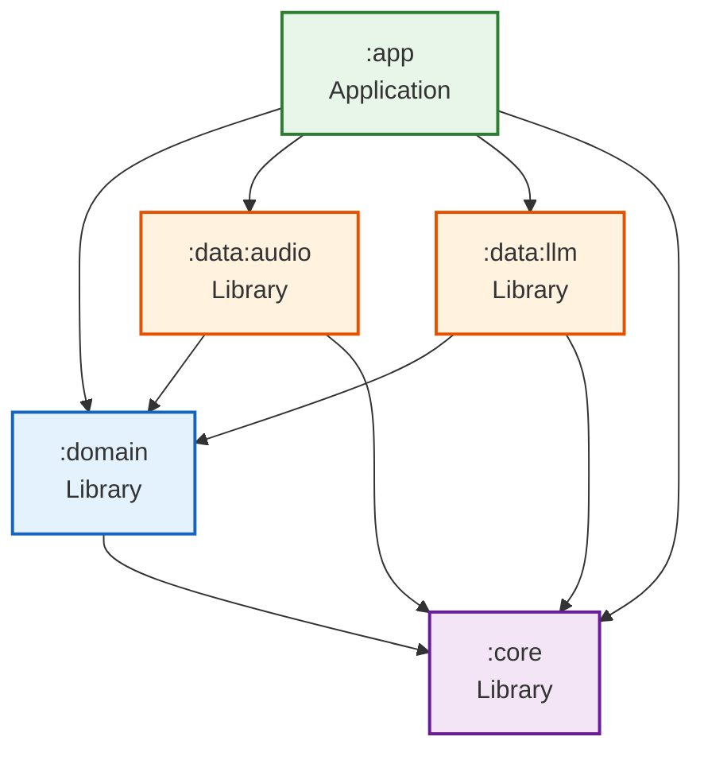

# DocScriptAI — Architecture & API Reference

Technical reference for the module architecture, public APIs, dependency graph, and contribution guidelines.

---

## Table of Contents

- [Architecture Overview](#architecture-overview)
- [Dependency Graph](#dependency-graph)
- [Module API Reference](#module-api-reference)
- [Build Configuration](#build-configuration)
- [Adding a New Module](#adding-a-new-module)
- [Extending the App](#extending-the-app)
- [Testing Strategy](#testing-strategy)
- [Contributing Guidelines](#contributing-guidelines)

---

## Architecture Overview

DocScriptAI follows Android's recommended **multi-module layered architecture**:

```
┌─────────────────────────────────────────────────────┐
│                    PRESENTATION                      │
│                                                      │
│   :app (MainActivity, CaptureFragment, ReportFragment)│
│   SharedViewModel, ServiceProvider                    │
└────────────────────┬────────────────────────────────┘
                     │ depends on
┌────────────────────┴────────────────────────────────┐
│                     DOMAIN                           │
│                                                      │
│   :domain (Models, Repository Interfaces, Use-Cases)  │
│   MedicalReport, TranscriptionRepository, LlmRepository│
│   TranscribeAudioUseCase, ExtractReportUseCase        │
└────────────────────┬────────────────────────────────┘
                     │ depends on
┌────────────────────┴────────────────────────────────┐
│                      DATA                            │
│                                                      │
│   :data:audio (VoskTranscriptionService, WavRecorder) │
│   :data:llm   (LlmProcessor)                         │
└────────────────────┬────────────────────────────────┘
                     │ depends on
┌────────────────────┴────────────────────────────────┐
│                      CORE                            │
│                                                      │
│   :core (AudioConfig, ResultState)                    │
└─────────────────────────────────────────────────────┘
```

### Layer Rules

| Rule | Description |
|---|---|
| **Unidirectional** | Dependencies always point downward: App → Domain → Data → Core |
| **Interface segregation** | `:domain` defines interfaces; `:data` modules implement them |
| **No cross-data deps** | `:data:audio` and `:data:llm` never depend on each other |
| **Core is a leaf** | `:core` depends on nothing — it's pure utilities |
| **App is the root** | Only `:app` knows about all modules and wires them together |

---

## Dependency Graph



### External Dependencies by Module

| Module | External Dependencies |
|---|---|
| `:core` | `androidx.core:core-ktx` |
| `:domain` | `kotlinx-coroutines-android` |
| `:data:audio` | `vosk-android@aar`, `jna@aar`, `kotlinx-coroutines-android` |
| `:data:llm` | `litertlm-android`, `kotlinx-coroutines-android` |
| `:app` | `appcompat`, `material`, `navigation-*`, `lifecycle-viewmodel`, `coordinatorlayout`, `cardview`, `recyclerview`, `activity`, `coroutines` |

---

## Module API Reference

### :core — `com.docscriptai.core`

```kotlin
// Constants for audio processing
object AudioConfig {
    const val SAMPLE_RATE: Int              // 16000
    const val SAMPLE_RATE_FLOAT: Float      // 16000.0f
    const val STREAM_BUFFER_BYTES: Int      // 8192
    const val TARGET_SAMPLE_RATE: Int       // 16000
    const val CODEC_TIMEOUT_US: Long        // 10000L
}

// Generic async state wrapper
sealed class ResultState<out T> {
    data object Loading : ResultState<Nothing>()
    data class Success<T>(val data: T) : ResultState<T>()
    data class Error(val exception: Throwable) : ResultState<Nothing>()
}
```

### :domain — `com.docscriptai.domain`

```kotlin
// ── Models ──
data class MedicalReport(
    val diagnosis: String,
    val medication: String,
    val otherTests: String,
    val followUp: String
)

// ── Repository Interfaces ──
interface TranscriptionListener {
    fun onModelReady()
    fun onModelError(error: String)
    fun onPartialResult(text: String)
    fun onFinalResult(text: String)
    fun onError(error: String)
}

interface TranscriptionRepository {
    val isModelReady: Boolean
    fun initModel(context: Context, listener: TranscriptionListener)
    fun transcribeFile(file: File, listener: TranscriptionListener)
    fun stopStreamTranscription()
    fun startLiveRecognition(listener: TranscriptionListener)
    fun stopLiveRecognition()
    fun destroy()
}

interface LlmRepository {
    val isModelLoaded: Boolean
    suspend fun loadModel(context: Context, modelPath: String): Result<Unit>
    suspend fun processTranscription(
        text: String,
        onFieldDone: suspend (field: String, value: String) -> Unit
    ): Result<MedicalReport>
    fun wouldTruncate(text: String): Boolean
    fun destroy()
}

// ── Use-Cases ──
class TranscribeAudioUseCase(repository: TranscriptionRepository) {
    fun transcribeFile(file: File, listener: TranscriptionListener)
    fun startLiveRecognition(listener: TranscriptionListener)
    fun stopTranscription()
    fun stopLiveRecognition()
}

class ExtractReportUseCase(repository: LlmRepository) {
    suspend fun execute(text: String, onFieldDone: ...): Result<MedicalReport>
    fun wouldTruncate(text: String): Boolean
}
```

### :data:audio — `com.docscriptai.data.audio`

```kotlin
// Vosk-based speech recognition (implements TranscriptionRepository)
class VoskTranscriptionService : TranscriptionRepository { ... }

// 16kHz 16-bit mono WAV recorder
class WavRecorder(cacheDir: File) {
    val isCurrentlyRecording: Boolean
    suspend fun startRecording(): File    // Returns WAV file path
    fun stopRecording()
}

// Audio format converter (any → 16kHz WAV)
class AudioConverter(context: Context) {
    suspend fun convertToWav(inputUri: Uri, outputFile: File): Result<File>
}
```

### :data:llm — `com.docscriptai.data.llm`

```kotlin
// LiteRT-LM based medical report extraction (implements LlmRepository)
class LlmProcessor : LlmRepository { ... }
```

### :app — `com.docscriptai.app`

```kotlin
// Fragment DI interface
interface ServiceProvider {
    val transcriptionRepo: TranscriptionRepository
    val llmRepo: LlmRepository
    val wavRecorder: WavRecorder
    val audioConverter: AudioConverter
    val transcribeUseCase: TranscribeAudioUseCase
    val extractReportUseCase: ExtractReportUseCase
}

// Shared state across fragments
class SharedViewModel : ViewModel() {
    val transcriptionBuilder: StringBuilder
    val transcriptionText: MutableLiveData<String>
    val isVoskReady: MutableLiveData<Boolean>
    val isLlmReady: MutableLiveData<Boolean>
}
```

---

## Build Configuration

### Gradle Structure

```
DocScriptAI/
├── settings.gradle.kts       # Module inclusion
├── build.gradle.kts           # Root plugin declarations
├── gradle.properties          # JVM args, AndroidX flags
├── gradle/
│   ├── libs.versions.toml     # Version catalog (single source of truth)
│   └── wrapper/
│       └── gradle-wrapper.properties  # Gradle 8.10.2
```

### Key Build Properties

| Property | Value | Location |
|---|---|---|
| `compileSdk` | 34 | All modules |
| `minSdk` | 26 | All modules |
| `targetSdk` | 34 | `:app` only |
| `applicationId` | `com.example.vosk` | `:app` (kept for APK compat) |
| `jvmTarget` | 17 | All modules |
| AGP version | 8.8.0 | `libs.versions.toml` |
| Kotlin version | 2.3.20 | `libs.versions.toml` |
| Gradle version | 8.10.2 | `gradle-wrapper.properties` |

### NDK Configuration

The `:app` module includes native libraries for Vosk/JNA:

```kotlin
ndk {
    abiFilters += listOf("armeabi-v7a", "arm64-v8a", "x86_64", "x86")
}
packaging {
    jniLibs { pickFirsts += setOf("**/libc++_shared.so") }
}
```

The `pickFirsts` rule resolves conflicts when multiple native libraries bundle their own copy of `libc++_shared.so`.

---

## Adding a New Module

### Example: Adding `:data:storage`

1. **Create directory:**
```bash
mkdir -p data/storage/src/main/java/com/docscriptai/data/storage
```

2. **Create `data/storage/build.gradle.kts`:**
```kotlin
plugins {
    alias(libs.plugins.android.library)
    alias(libs.plugins.kotlin.android)
}
android {
    namespace = "com.docscriptai.data.storage"
    compileSdk = 34
    defaultConfig { minSdk = 26 }
    // ... compiler options
}
dependencies {
    implementation(project(":core"))
    implementation(project(":domain"))
}
```

3. **Add to `settings.gradle.kts`:**
```kotlin
include(":data:storage")
```

4. **Add interface to `:domain` if needed:**
```kotlin
// domain/.../repository/StorageRepository.kt
interface StorageRepository { ... }
```

5. **Implement in `:data:storage`**
6. **Add dependency in `:app/build.gradle.kts`:**
```kotlin
implementation(project(":data:storage"))
```

---

## Extending the App

### Adding a New Language

1. Download the Vosk model for your language from [alphacephei.com/vosk/models](https://alphacephei.com/vosk/models)
2. Place it in `app/src/main/assets/model-<lang>/`
3. Update the `MODEL_NAME` constant in `VoskTranscriptionService.kt`
4. Translate the LLM system prompt in `LlmProcessor.kt`

### Adding a New LLM Backend

1. Create a new module (e.g., `:data:cloud-llm`)
2. Implement `LlmRepository` interface
3. Wire the new implementation in `MainActivity.onCreate()`

### Adding a Third Page

1. Create `fragment_<name>.xml` layout
2. Create `<Name>Fragment.kt`
3. Add fragment to `nav_graph.xml` with actions
4. Add navigation trigger in the source fragment

---

## Testing Strategy

### Unit Tests

Each module can be tested independently:

```bash
# Test domain use-cases (mock repositories)
./gradlew :domain:test

# Test core utilities
./gradlew :core:test

# Test data layer with mocked Android APIs
./gradlew :data:audio:test
./gradlew :data:llm:test
```

### Integration Tests

```bash
# Instrumented tests on device
./gradlew :app:connectedAndroidTest
```

### Manual Testing Checklist

- [ ] Fresh install → Vosk model unpacks successfully
- [ ] Record 30s Hindi speech → transcription appears
- [ ] Upload MP3 → converted and transcribed
- [ ] Load .task model → LLM badge turns green
- [ ] Process transcription → report cards appear
- [ ] Tap "New Recording" → state cleared, back to capture
- [ ] Kill app during recording → no crash on restart
- [ ] Rotate device → state preserved (ViewModel)

---

## Contributing Guidelines

### Code Style
- **Kotlin**: Follow [Kotlin coding conventions](https://kotlinlang.org/docs/coding-conventions.html)
- **XML**: Use `camelCase` for IDs, `snake_case` for resource names
- **Comments**: Document *why*, not *what* — the code should explain what it does

### Commit Messages
Follow [Conventional Commits](https://www.conventionalcommits.org/):
```
feat: add English language support
fix: prevent crash on empty transcription
docs: update user guide with troubleshooting
refactor: extract AudioPlayer to :data:audio
```

### Branch Strategy
- `master` — stable, production-ready
- `feature/<name>` — new features
- `fix/<name>` — bug fixes

### Pull Request Checklist
- [ ] Code compiles: `./gradlew assembleDebug`
- [ ] No new warnings
- [ ] New public APIs documented
- [ ] UI changes tested on phone and tablet
- [ ] Commit messages follow conventions
